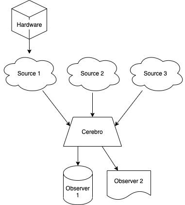

Introduction and concepts
=========================

``cerebro`` automates the process of collecting time-series data from multiple, potentially mismatched sources, and storing them in one or more services with a uniform datamodel. The SDSS use-case is to collect information from different subsystems (actors, FPS telemetry, weather data) and store it in an `InfluxDB <https://www.influxdata.com>`__ database, but it's general enough to be used with other backends and frontends.

``cerebro`` is strongly influenced by the concepts introduced by `ReactiveX <http://reactivex.io>`__ and it makes use  of the `Python implementation <https://github.com/ReactiveX/RxPY>`__. Rx can be unnecessarily complicated for many applications, so ``cerebro`` tries to simplify the process while retaining the machinery.

While it's not necessary to have a deep understanding of the concepts in Rx, a basic familiarity with them and with how ``cerebro`` works is recommended. The following diagram shows a simple example of use.

Here we see different sources of data (Sources 1 to 3), some of which may be retrieving data from a connected hardware. ``cerebro`` acts as funnel collecting the information from all the sources and then passing it to each one of the "observers".

The following concepts are central to how ``cerebro`` works:

* **Sources**. A source is an entity that emits data. It may be a temperature sensor, a stream of data from a message passing system, or a process that produces a series of data points. Often sources are connected or read from a piece of hardware. Sources emit *data points* (see below) associated with a certain time. In ``cerebro`` sources are always instances of a given `.Source` class that defines how to access and read the data, and formats it as valid data points that are then made available to ``cerebro``. Sources are Rx `Subjects <https://rxpy.readthedocs.io/en/latest/reference_subject.html>`__.

* **Observers**. Observers are entities that receive data from one or several sources and output or store them with a uniform datamodel Examples of observables are a time series database (e.g., InfluxDB) or a process that collects all the source data and streams it as a datagram. In ``cerebro`` observers are based on Rx `Observers <https://rxpy.readthedocs.io/en/latest/reference_typing.html#rx.core.typing.Observer>`__ and are instances of an `.Observer` subclass.

* **Cerebro**. An instance of `.Cerebro` acts as a subject and listens to all the sources running. Every time a source issues data, it makes it available to all the observers that are connected. Cerebro also handles the creation of sources and observer instances from a :ref:`configuration file <configuration-file>` or command line.

* **Data points**. Sources emit data points, which are named tuples consisting of a list of data and, where relevant, a valid ``bucket`` where to store the data. The data is a list of dictionaries, each dictionary representing a data point in time. Each data point consists of a *measurement* (a string indicating the type of data measured), a dictionarty of *fields* (in the format ``{field1: value1, field2, value2, ...}``) associated with the measurement, a dictionary of keyword-value *tags*, and the *time* of the measurement. This structure is heavily inspired by the `InfluxDB data structure <https://docs.influxdata.com/influxdb/v2.0/reference/key-concepts/data-elements/>`__. Data points are instances of `.DataPoints`.

To see practical examples of how to define data sources, observers, and data points, head to :ref:`getting-started`.
